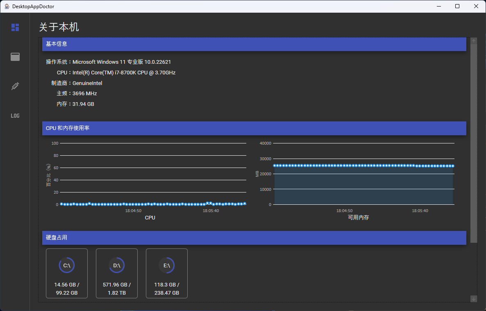
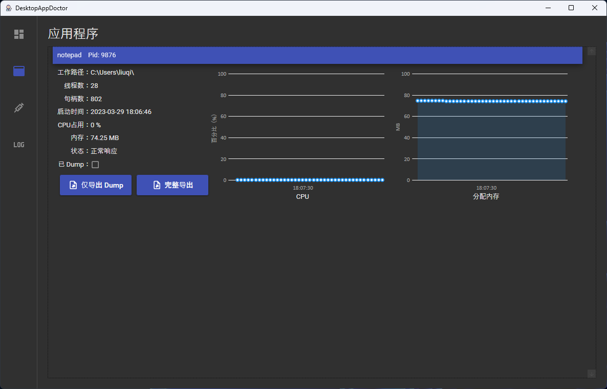

# DesktopAppDoctor

## 一、简介

`DesktopAppDoctor` 是一款用来帮助开发者诊断 Windows 桌面应用程序未响应和崩溃问题的辅助工具。

此工具可以在后台运行，周期性地检测特定应用程序的工作状态，若应用程序未响应或者崩溃退出，则会自动导出当前系统和应用的相关信息和 Dump 文件并打包到指定位置。

此工具收集的相关信息如下：

- 系统 CPU 使用率
- 系统内存使用率
- 硬盘使用率
- 网卡使用率
- Windows 应用程序事件
- 应用程序 CPU 使用率
- 应用程序内存使用率

## 二、使用方法

启动软件后，切换到`诊断助手`Tab页，在关联进程一栏中填入待诊断进程名称（不包含.exe），然后点击保存即可。

可以单独配置是否检测崩溃、是否检测未响应。

## 三、注意事项

一个进程如果已经被 Dump 过一次，那么在下次的检查周期中，不会被再次 Dump。用户仍可以手动 Dump。也可以在应用程序页面中，取消勾选`已 Dump`复选框，这样程序会在下一次的检查中再次 Dump。

## 四、截图

